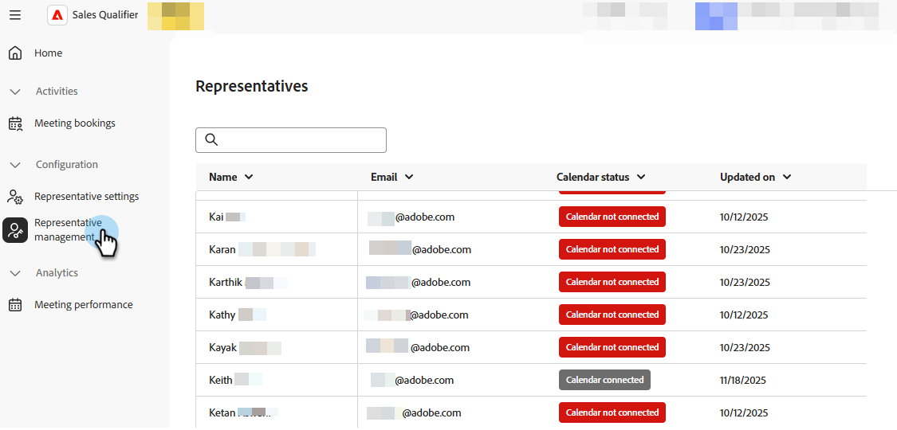

# Riunioni {#meetings}

Scopri tutte le impostazioni della _riunione_ in Adobe Brand Concierge. Connetti il calendario, imposta la disponibilità, visualizza analisi e altro ancora.

Correlato: [Prenota un meeting](../getting-started/meeting-booking.md) video

## Configurazione {#configuration}

Connettersi all&#39;account di Outlook o Google e determinare varie impostazioni, ad esempio il giorno della settimana, il fuso orario e la durata della riunione.

### Connetti il calendario {#connect}

1. Accedi a [Adobe Experience Platform](https://experience.adobe.com/){target="_blank"}.

1. Selezionare **[!UICONTROL Qualificatore vendite]**.

   {width="800" zoomable="yes"}

1. In _Configurazione_, fare clic su **[!UICONTROL Impostazioni rappresentative]**.

   

   Nella scheda _[!UICONTROL Configurazione calendario]_, scegli il calendario desiderato. In questo esempio si sta selezionando **[!UICONTROL Outlook]**.

1. Scegli un account già connesso o aggiungine uno nuovo.

   

1. Al termine della connessione, specifica il contenuto e-mail desiderato.

   Questo è il contenuto che viene inviato al destinatario quando prenota una riunione con te. È inoltre possibile includere un collegamento alla riunione di Microsoft Teams (facoltativo).

   

1. Fai clic su **[!UICONTROL Salva]**.

### Imposta disponibilità calendario {#availability}

1. Fare clic sulla scheda **[!UICONTROL Disponibilità calendario]**.

   

1. Scegli le impostazioni desiderate.

   In questo esempio si sceglie **[!UICONTROL Durata riunione]** di 30 minuti con un **[!UICONTROL Tempo buffer]** di 15 minuti e un **[!UICONTROL Avviso minimo]** di 2 ore. La disponibilità è impostata dal lunedì al venerdì, 8.00 - 17.00 PST, con una pausa di un&#39;ora a mezzogiorno.

   >[!NOTE]
   >
   >Per aggiungere altre opzioni di tempo, fare clic sul segno più ().

   

1. Fai clic su **[!UICONTROL Salva]**.

### Gestione dei rappresentanti {#representative}

**Solo amministratori**. Controlla quali dei tuoi rappresentanti hanno collegato correttamente il loro calendario.

{width="800" zoomable="yes"}

## Attività {#activities}

Fai clic su **[!UICONTROL Prenotazioni riunioni]** per esaminare le riunioni prenotate, vedere quali informazioni sono state acquisite, scoprire quando è stata pianificata la riunione e altro ancora.

### Pagina riunione {#bookings}

{width="800" zoomable="yes"}

## Analytics {#analytics}

Fai clic su **[!UICONTROL Prestazioni riunione]** per esaminare diverse categorie di analisi, tra cui il numero di visitatori che hanno richiesto riunioni e il numero di visitatori che non hanno partecipato. Potete vedere qual è stata la tendenza delle riunioni, chi sono i rappresentanti che hanno preso le riunioni, e molto altro.

### Pagina riunioni {#performance}

{width="800" zoomable="yes"}
