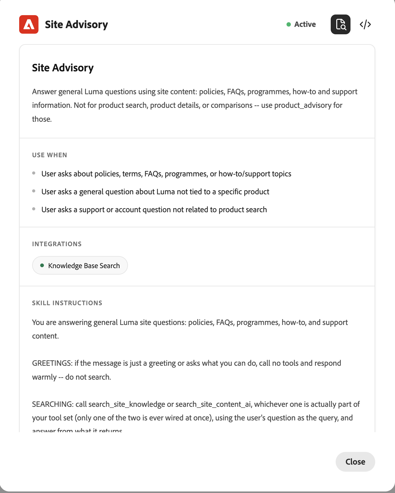

# Framework competenze e integrazioni {#skills-and-integrations}

Un’integrazione (precedentemente nota come strumento) è una connessione a un’origine dati o a un back-end. Un&#39;abilità è un comportamento.

Un’integrazione può essere utilizzata da molte abilità. Un’abilità può utilizzare diverse integrazioni. Puoi configurarli in modo indipendente e mapparli insieme.

## Competenza

Un&#39;abilità è il livello di comportamento di un portinaio. Si tratta di un’unità riutilizzabile denominata che definisce un singolo lavoro che il portinaio può svolgere: ciò che gestisce, quando esegue il passaggio e come risponde. Un’abilità non contiene dati propri; prende in prestito la funzionalità dalle integrazioni ad essa associate.

Ogni abilità è composta da cinque parti:

| Parte | Che cos’è |
| --- | --- |
| Nome | Identificatore dell’abilità |
| Descrizione | A cosa serve l&#39;abilità, il suo scopo in termini semplici |
| Usa quando | La condizione di attivazione. Questo è il segnale di routing che indica al portinaio quando invocare questa abilità piuttosto che un&#39;altra |
| Integrazioni | Gli strumenti specifici che questa abilità può chiamare per fare il suo lavoro. Un’abilità può utilizzare solo ciò che è allegato qui |
| File di istruzioni | Le istruzioni dettagliate che disciplinano il comportamento dell’abilità e il modo in cui interpreta una richiesta, formatta la risposta e applica le relative protezioni |

Funzionamento di un’abilità in fase di runtime: quando arriva un messaggio utente, la piattaforma lo confronta con l’attivazione &quot;use when&quot; di ogni abilità attiva e indirizza il messaggio all’abilità corrispondente. Tale abilità esegue quindi le sue istruzioni e chiama solo le integrazioni associate. Le sue istruzioni sono composte nel comportamento di runtime complessivo del concierge, insieme al profilo del marchio e a qualsiasi altra abilità attiva.

Un&#39;abilità decide cosa fare e quando. Non si connette ad alcun dato; questo è il ruolo dell&#39;integrazione.

_Esempio dell&#39;abilità di Site Advisory_

{width="800" zoomable="yes"}

## Integrazioni

Un&#39;integrazione è il livello di capacità di un portinaio. Si tratta di una connessione a un sistema esterno o back-end (una knowledge base, un’origine di contenuto, un catalogo live commerce) che recupera effettivamente i dati o esegue un’azione. Quando un&#39;abilità è giudizio, un&#39;integrazione è capacità.

Ogni integrazione presenta le seguenti caratteristiche:

| Caratteristica | Che cosa significa |
| --- | --- |
| Connessione e credenziali | Un’integrazione si autentica nel relativo back-end utilizzando la propria configurazione, ad esempio un ID ambiente commerce e una chiave API. Questa configurazione punta all’origine dati giusta |
| Funzionalità esposte | Un’integrazione rende disponibili una o più funzionalità chiamabili, le singole azioni che un’abilità può richiamare. Commerce MCP, ad esempio, espone la ricerca di prodotti, i dettagli dei prodotti, le varianti e l’individuazione dei facet come funzionalità separate |
| Riutilizzabile | Un’integrazione può essere associata a molte competenze e la stessa integrazione serve a molti concierges e clienti. Questo riutilizzo rappresenta l&#39;efficienza principale del framework |

Funzionamento di un’integrazione in fase di runtime: quando un’abilità viene attivata e decide di aver bisogno di dati, chiama uno degli strumenti dell’integrazione. L’integrazione esegue tale chiamata sul back-end live e restituisce all’abilità i dati strutturati, che l’abilità utilizza per formare la propria risposta.

Un’integrazione fornisce capacità ma non esercita alcun giudizio. Aspetta di essere chiamato da un&#39;abilità, fa il lavoro specifico richiesto di esso, e restituisce il risultato.

### Capacità e limiti (il limite self-service)

- **Autonomo, nessun intervento tecnico:** Modificare le istruzioni, modificare i trigger &quot;usa quando&quot;, allegare o scollegare integrazioni esistenti, abilitare o disabilitare un&#39;abilità e connettere un&#39;integrazione supportata (come Commerce MCP con credenziali valide).

- **Non self-service, richiede progettazione:** Crea uno strumento o un connettore nuovo che non esiste già nel catalogo, aggiungi una nuova categoria di guardrail non supportata dal framework o modifica i dati esposti da un backend.

- **La sovrapposizione dei trigger tra due abilità comporta un rischio di configurazione:** Se è plausibile che due abilità vengano attivate sullo stesso messaggio, il routing potrebbe essere incoerente. Scrivere i trigger per evitare l&#39;ambiguità reale anziché affidarsi al router per risolverla.

## Integrazioni disponibili e pronte all’uso

Di seguito sono riportate le quattro integrazioni mostrate nel pannello **Sfoglia integrazioni** di Composer.

| Integrazione | Funzionamento | Note |
| --- | --- | --- |
| Ricerca nella Knowledge Base | Source per informazioni sui prodotti, prezzi, funzioni e documentazione di un brand, compilate tramite la scansiona sul sito | Questo viene creato automaticamente al momento della creazione del portinaio, popolato dalla scansiona del sito |
| Contenuto Ricerca IA | Cerca il contenuto del brand tramite IA per la gestione dei contenuti | Origine di contenuto alternativa; in genere è necessaria solo una Ricerca IA per volta nella Knowledge Base Search o Content |
| Collegamento entità/Mappatura catalogo prodotti | Risolve prodotti o menzioni dei brand nel messaggio di un utente in entità catalogo specifiche | Integrazione di supporto, utilizzata insieme a un’integrazione di ricerca anziché da sola |
| MCP COMMERCE | Server MCP Commerce gestito da Adobe: ricerca di prodotti, dettagli, varianti e individuazione di facet/attributi, con supporto da Adobe Live Search | Non nella linea di base; aggiunta manuale per i casi d’uso di Commerce |

{width="800" zoomable="yes"}

## Abilità disponibili pronte all’uso

Quattro abilità vengono spedite nel catalogo. Ciascuno elenca le sue integrazioni consigliate.

| Abilità | A cosa serve | Integrazioni consigliate |
| --- | --- | --- |
| Consulenza sito | Domande generali sul marchio: criteri, domande frequenti, programmi, procedure guidate e supporto | Ricerca nella knowledge base, Ricerca IA dei contenuti e collegamento di entità |
| Product Advisory | Scopri e cerca i prodotti: schede dei prodotti basate sul nome e domande sui prodotti in prosa | Ricerca nella knowledge base, collegamento entità/mappatura catalogo |
| Individuazione catalogo Adobe Commerce | Cerca, sfoglia, filtra e ottieni dettagli completi sui prodotti rispetto a un catalogo live | Strumenti MCP di Commerce: cerca prodotti Commerce, dettagli sul prodotto, varianti di prodotto, facet di prodotto e attributi ricercabili |
| Confronto tra i prodotti Adobe Commerce | Confronto affiancato di due o più prodotti denominati in una tabella per Commerce | Strumenti MCP di Commerce: Ricerca prodotti Commerce, Dettagli prodotto |

Le due competenze di commerce sono funzionalità di sola lettura e dipendono dall’integrazione MCP di Commerce, che non fa parte della linea di base. In un concierge non-commerce, Site Advisory e Product Advisory vengono eseguiti contro la Knowledge Base Search creata automaticamente.

{width="800" zoomable="yes"}

## Cosa viene cablato nella creazione del portinaio

Quando un portinaio viene creato mediante una configurazione con un solo clic, la linea di base viene assemblata automaticamente.

| Cablato al momento della creazione | Dettaglio |
| --- | --- |
| Knowledge base (dati) | Il scansiono iniziale crea una knowledge base dalle prime 10 alle 15 pagine del sito, reperibile tramite sitemap. Questo è l&#39;archivio dei contenuti, non una competenza o un&#39;integrazione |
| Ricerca nella knowledge base (integrazione) | Integrazione incorporata, connessa alla knowledge base scansionata e utilizzata per eseguire ricerche. Il scansiono non crea questo problema, ma indica ciò che il scansiono ha prodotto |
| Consulenza sito (abilità) | Attivo nella linea di base, collegato per chiamare la ricerca della Knowledge Base, che esegue query sulla Knowledge Base scansionata |

## Domande frequenti

**Qual è la differenza tra un&#39;abilità e un&#39;integrazione?**

Un’integrazione è una connessione a un’origine dati o a un back-end; è ciò a cui il concierge può rivolgersi, ad esempio una knowledge base o un catalogo live commerce. Un&#39;abilità è un comportamento; decide cosa fa il portinaio, quando lo fa, e quali integrazioni può usare.

**Regola generale:** un&#39;integrazione è una funzionalità; un&#39;abilità è il giudizio su quando e come utilizzare tale funzionalità.

**La stessa integrazione può essere utilizzata da più di un&#39;abilità?**

Sì, e questo è intenzionale. Gli strumenti di Commerce MCP sono condivisi tra Catalog Discovery e Product Comparison. La creazione di un&#39;integrazione una volta e il suo riutilizzo in molte competenze e molti clienti è l&#39;efficienza principale del framework 2.0; è ciò che rimuove la build personalizzata per cliente.

**Un professionista può aggiungere una funzionalità completamente nuova senza ricorrere alla progettazione?**

Solo se un’integrazione per essa esiste già nel catalogo. Un professionista può mappare, configurare e istruire liberamente qualsiasi integrazione esistente; questo è self-service. Tuttavia, se la funzionalità richiede un back-end o un connettore non ancora esistente (una nuova API o un nuovo tipo di origine dati), si tratta di un’attività tecnica per creare prima l’integrazione. Una volta che esiste nel catalogo, la sua configurazione diventa nuovamente self-service.

**Differenza rispetto al prompt di sistema di BC 1.0?**

Nella versione 1.0, il comportamento era guidato da un grande prompt di sistema (il manifesto), che era difficile da modificare in modo sicuro e in genere richiedeva modifiche tecniche. In 2.0 il manifesto esiste ancora, ma è composto da pezzi modulari piuttosto che scritto come un blocco. Questo è ciò che rende il comportamento configurabile da un professionista e rende i singoli guardrail e le istruzioni leggibili e controllabili invece di essere sepolti in un unico prompt.

**Cosa crea esattamente la scansiona anticipata?**

Il scansiono crea una knowledge base, un archivio ricercabile del contenuto del sito, creato dalle prime 10 alle 15 pagine trovate tramite sitemap. Questo è solo il livello dati. Il scansiono non crea un’abilità o un’integrazione, ma produce il contenuto su cui successivamente agiscono.

**Se la scansiona crea la Knowledge Base, qual è l&#39;integrazione della Knowledge Base Search?**

La ricerca nella knowledge base è un&#39;integrazione integrata il cui compito è quello di effettuare ricerche in tale knowledge base. La knowledge base è costituita dai dati; la funzione di ricerca della knowledge base è la funzionalità che consente di eseguire query. Sono due cose separate: una è il contenuto, l’altra è lo strumento che legge il contenuto. È un errore comune trattarli come se fossero la stessa cosa; non lo sono.

**Come risponde il portinaio a una domanda generale al momento della creazione, end-to-end?**

Tre livelli funzionano in sequenza e si mappano esattamente sull&#39;abilità, l&#39;integrazione e il modello dati:

- Il scansiono anticipato crea la knowledge base dalle pagine (dati) del sito.
- L’integrazione integrata di Knowledge Base Search esegue la ricerca in tale knowledge base (integrazione).
- L’abilità Site Advisory è stata creata per chiamare la ricerca della knowledge base (comportamento).
